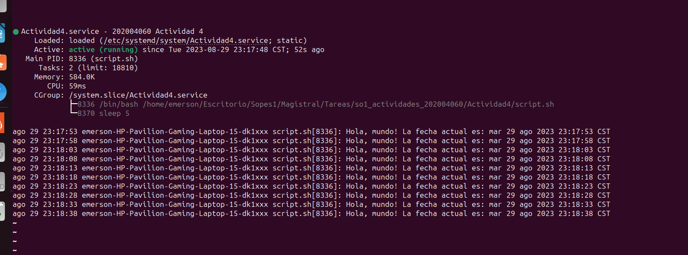

# Actividad 4 - Systemd Unit
Crear un systemd unit de tipo servicio para ejecutar un script imprima un saludo y la fecha actual. 

Opcionalmente el script puede ser mas complejo para que este no termine y se quede imprimiendo hola mundo cada cierta cantidad de tiempo.

# Pasos Realizados
Paso 1: Se creó un scrip sencillo que saluda y da la fecha actual  con un intervalo de 5 segundos.
```python
#!/bin/bash
while true; do
    echo "Hola, mundo! La fecha actual es: $(date)"
    # Intervalo de tiempo en segundos
    sleep 5  
done
```
Paso 2: Le otorgamos permisos al script creado en el directorio correcto.
```python
chmod 777 script.sh
```
Paso 3. Ahora ingresamos a la siguiente dirección para crear un systemd unit de tipo servicio.
```python
cd /etc/systemd/system/
```
Paso 4. Creamos un archivo con extensión .service con el siguiente comando
```python
touch Actividad4.service
```
Paso 5. Ahora escribimos en el archivo, para ello podemos usar el siguiente comando "sudo nano Actividad4.service"  y escribimos la siguiente instrucciones.
```python
[Unit]
Description= 202004060 Actividad 4 

[Service]
User=emerson
ExecStart=/home/emerson/Escritorio/Sopes1/Magistral/Tareas/so1_actividades_202004060/Actividad4/script.sh
[Install]
WantedBy=multi-user.target
```
Donde :
 
- Description: Se ingresa un comnetario sobre la actividad o lo que el usuario desea.
- User: el usuario del sistema operativo que ejecutará el daemon.
- ExecStart: Es obligatorio la ruta absoluta  al script.
- WantedBy: directivas de uso y otras dependencias.

Paso 6. Recargamos los servidores para incluir el nuevo archivo.
```
sudo systemctl daemon-reload  
```
Paso 7. Habilitamos el servidor que hemos creado.
```
sudo systemctl enable Actividad4.service   
```
Paso 8. Ahora se inicia el servidor, el cual ejecuta el script.
```
sudo systemctl start Actividad4.service  
```
Paso 9. Verificamos el estado del servidor para ver si se ejecuta correctamente.
```
sudo systemctl status Actividad4.service    
```

Se muestra el resultado correcto y que se repite cada 5 segundos

Nota: si deseamos detener el servidor, podemos usar el siguiente comando: 
```
sudo systemctl stop Actividad4
```